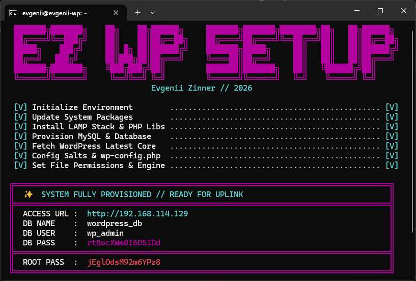

# EZ WP Setup // 🚀 Quick WordPress Install



[](LICENSE)
[](https://ubuntu.com/)
[](https://www.gnu.org/software/bash/)
[](https://wordpress.org/download/)

`wordpress-install` `quick-wp-installation`

A collection of high-performance shell scripts for **quick WP installation** and automated **WordPress install** on Ubuntu/Debian. Provision a complete LAMP stack with optimized performance in seconds.

## ✨ Scripts Included

- **`install_fresh_mysql.sh`**: Automatic WordPress setup using **MySQL**.
- **`install_fresh_mariadb.sh`**: Ultra-fast WordPress installation using **MariaDB**.

---

## ⚡ Quick Start

Deploy your WordPress site instantly. Pull and run any of the scripts directly on your server.

> [!IMPORTANT]
> Always run these scripts with `sudo` or as the `root` user for a successful **WordPress install**.

### Option A: Using `curl`
```bash
curl -sSL https://raw.githubusercontent.com/Evgenii-Zinner/ez_wp_setup/main/install_fresh_mysql.sh -o setup.sh && chmod +x setup.sh && sudo ./setup.sh
```

### Option B: Using `wget`
```bash
wget -q -O setup.sh https://raw.githubusercontent.com/Evgenii-Zinner/ez_wp_setup/main/install_fresh_mariadb.sh && chmod +x setup.sh && sudo ./setup.sh
```

---

## 🛠 What's inside?

- **LAMP Stack**: Apache2, PHP (with all WP-required extensions), and your choice of DB for a **complete wordpress installation**.
- **Auto-Provisioning**:
    - Generates secure random passwords for DB and Root.
    - Automatically fetches the latest WordPress core.
    - Configures `wp-config.php` with salts and DB credentials.
    - Sets correct file permissions (`www-data`).
    - Configures Apache `mod_rewrite`.

---

## 🖥 VM Test Environment Setup

Perfect for local development or testing your **quick wp installation** on a Virtual Machine (VirtualBox, VMware, Proxmox):

1.  **Networking**: Set your VM adapter to **Bridge Mode**.
2.  **SSH Access**: Ensure `openssh-server` is installed.

---

## 🤝 Contributing

Feel free to open an issue or add new scripts for other installations (e.g., Nginx, Redis, specific PHP versions). Your contributions help make this the best **easy WordPress install** tool!

---

## 📜 License

[MIT License](LICENSE) - Copyright (c) 2026 [Evgenii Zinner](https://github.com/Evgenii-Zinner)
